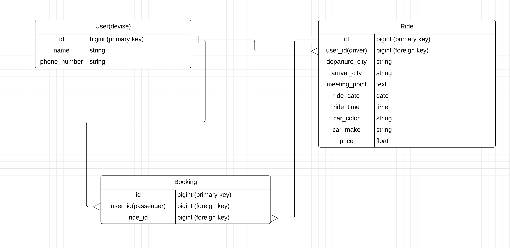

# README

This README would normally document whatever steps are necessary to get the
application up and running.

Things you may want to cover:

* Ruby version

* System dependencies

* Configuration

* Database creation

* Database initialization

* How to run the test suite

* Services (job queues, cache servers, search engines, etc.)

* Deployment instructions

# R7 and R8 - Identification of the problem you are trying to solve by building this particular marketplace app. / Why is it a problem that needs solving?
### CMP1042-3.1

# R9 - Link to the deployed app
<br>
HitchARide on Heroku:

[https://fathomless-citadel-09367.herokuapp.com]

### There are two test accounts that you can use and try out:
* email: test1@gmail.com , password: 123456
* email: test2@gmail.com , password: 123456

# R10 - Link to the GitHub repository
<br>
HitchARide on GitHub:

[https://github.com/DevSamaa/CarPoolTwo]

# R11 - Description of your marketplace app
- Purpose
- Functionality / features
- Sitemap
- Screenshots
- Target audience
- Tech stack (e.g. html, css, deployment platform, etc)

# R12 - User stories
### CMP1042-6.1 

# R13 - Wireframes
### CMP1042-6.2


# R14 - ERD
### PRG1048-1.1




# R15 - Explain the different high-level components (abstractions)
### CMP1042-1.2
The app is built with the Ruby on Rails Framework. 

Ruby on Rails normally follows the MVC setup, meaning that it's made up of models, views and controllers who each play their own roles in the app. 
* Active Record: 
Active Record is the M (model) part of the MVC. This is the layer of the system responsible for representing business data and logic. Active Record facilitates the creation and use of business objects whose data requires persistent storage to a database. So the models basically stipulate how the database will be sotring information and relating to other databases.
* Object Relational Mapping: 
It is an implementation of the Active Record pattern which itself is a description of an Object Relational Mapping system.
Object Relational Mapping, commonly referred to as its abbreviation ORM, is a technique that connects the rich objects of an application to tables in a relational database management system. Using ORM, the properties and relationships of the objects in an application can be easily stored and retrieved from a database without writing SQL statements directly and with less overall database access code. This means that rather than having to write SQL code everytime you want to interact with an object that is stored in the database, you can just utilize ruby code in the controller. 
* Form Helper:
As the name suggest, form helpers make it easer for the developer to implement a form. This rails app uses the form_with helper in order to create a form for a new ride as well as editing a ride. 
* Active Storage:
Active Storage facilitates uploading files to a cloud storage service like Amazon S3, Google Cloud Storage, or Microsoft Azure Storage and attaching those files to Active Record objects. I have added the active storage component to my app when I added the function for the users to be able to upload in image of their car to AWS S3. This can be seen in the form that the users fill out in order to create a new ride. 


# R16 - Detail any third party services that your app will use
### CMP1042-1.3 

The app uses the following third party services:
* Devise
* Stripe
* AWS S3: 

# R17 - Describe your projects models in terms of the relationships (active record associations) they have with each other
### CMP1042-3.3


# R18 - Discuss the database relations to be implemented in your application

# R19 - Provide your database schema design
### CMP1042-4.3

```ruby
ActiveRecord::Schema.define(version: 2019_11_05_075059) do

  # These are extensions that must be enabled in order to support this database
  enable_extension "plpgsql"

  create_table "active_storage_attachments", force: :cascade do |t|
    t.string "name", null: false
    t.string "record_type", null: false
    t.bigint "record_id", null: false
    t.bigint "blob_id", null: false
    t.datetime "created_at", null: false
    t.index ["blob_id"], name: "index_active_storage_attachments_on_blob_id"
    t.index ["record_type", "record_id", "name", "blob_id"], name: "index_active_storage_attachments_uniqueness", unique: true
  end

  create_table "active_storage_blobs", force: :cascade do |t|
    t.string "key", null: false
    t.string "filename", null: false
    t.string "content_type"
    t.text "metadata"
    t.bigint "byte_size", null: false
    t.string "checksum", null: false
    t.datetime "created_at", null: false
    t.index ["key"], name: "index_active_storage_blobs_on_key", unique: true
  end

  create_table "bookings", force: :cascade do |t|
    t.bigint "user_id"
    t.bigint "ride_id"
    t.datetime "created_at", null: false
    t.datetime "updated_at", null: false
    t.index ["ride_id"], name: "index_bookings_on_ride_id"
    t.index ["user_id"], name: "index_bookings_on_user_id"
  end

  create_table "rides", force: :cascade do |t|
    t.bigint "user_id"
    t.string "departure_city"
    t.string "arrival_city"
    t.text "meeting_point"
    t.date "ride_date"
    t.time "ride_time"
    t.string "car_color"
    t.string "car_make"
    t.float "price"
    t.datetime "created_at", null: false
    t.datetime "updated_at", null: false
    t.index ["user_id"], name: "index_rides_on_user_id"
  end

  create_table "users", force: :cascade do |t|
    t.string "email", default: "", null: false
    t.string "encrypted_password", default: "", null: false
    t.string "reset_password_token"
    t.datetime "reset_password_sent_at"
    t.datetime "remember_created_at"
    t.string "name"
    t.string "phone_number"
    t.datetime "created_at", null: false
    t.datetime "updated_at", null: false
    t.index ["email"], name: "index_users_on_email", unique: true
    t.index ["reset_password_token"], name: "index_users_on_reset_password_token", unique: true
  end

  add_foreign_key "active_storage_attachments", "active_storage_blobs", column: "blob_id"
  add_foreign_key "bookings", "rides"
  add_foreign_key "bookings", "users"
  add_foreign_key "rides", "users"
end
```

# R20 - Describe the way tasks are allocated and tracked in your project (Trello)
### CMP1042-6.3


Extra ( not part of the top thing on canvas - but this is graded - see how it fits in)
# CMP1042-4.2
